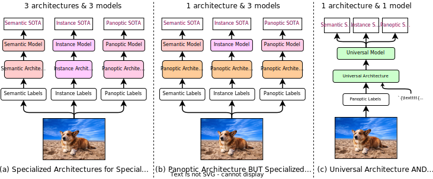
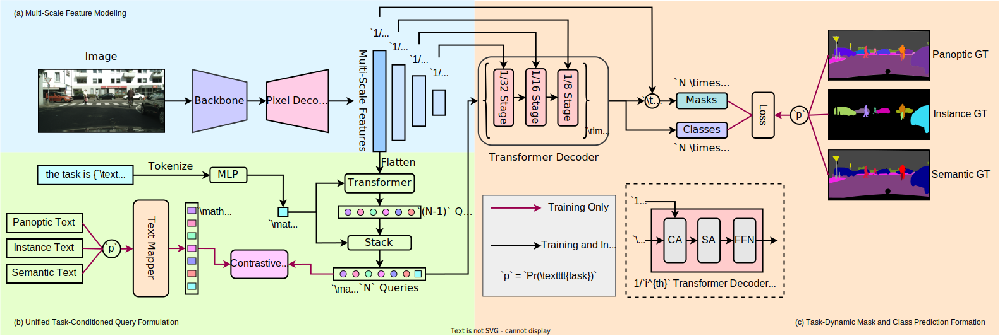
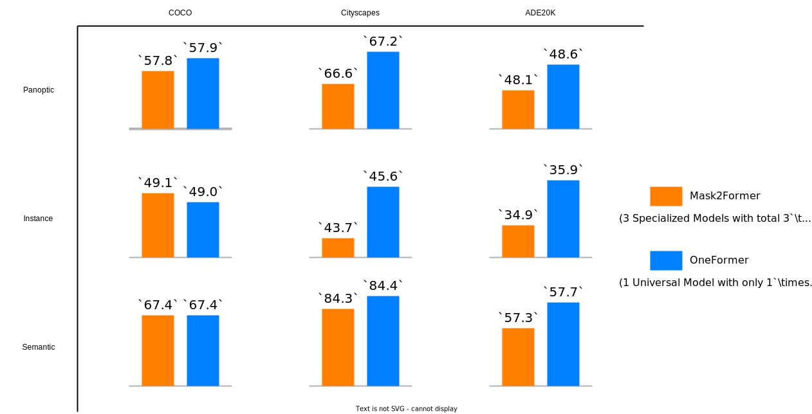

# OneFormer: One Transformer to Rule Universal Image Segmentation

[](https://pytorch.org/) [](https://colab.research.google.com/github/SHI-Labs/OneFormer/blob/main/colab/oneformer_colab.ipynb) [](https://opensource.org/licenses/MIT)

<!-- [](https://huggingface.co/spaces/shi-lab/OneFormer) -->

[Jitesh Jain](https://praeclarumjj3.github.io/), [Jiachen Li](https://chrisjuniorli.github.io/)<sup>&dagger;</sup>, [MangTik Chiu](https://www.linkedin.com/in/mtchiu/)<sup>&dagger;</sup>, [Ali Hassani](https://alihassanijr.com/), [Nikita Orlov](https://www.linkedin.com/in/nukich74/), [Humphrey Shi](https://www.humphreyshi.com/home)

<sup>&dagger;</sup> Equal Contribution

[[`Project Page`](https://praeclarumjj3.github.io/oneformer/)] [[`arXiv`](http://arxiv.org/abs/2208.03382)] [[`pdf`](http://arxiv.org/pdf/2208.03382.pdf)] [[`BibTeX`](#4citation)]

This repo contains the code for our paper **OneFormer: One Transformer to Rule Universal Image Segmentation**.



#### Features

- OneFormer is the **first** multi-task universal image segmentation framework based on transformers.
- OneFormer needs to be trained only once with a single universal architecture, a single model, and on a single dataset , to outperform existing frameworks across semantic, instance, and panoptic segmentation tasks.
- OneFormer uses a task-conditioned joint training strategy, uniformly sampling different ground truth domains (semantic instance, or panoptic) by deriving all labels from panoptic annotations to train its multi-task model.
- OneFormer uses a task token to condition the model on the task in focus, making our architecture task-guided for training, and task-dynamic for inference, all with a single model.

## Contents

1. [News](#news)
2. [Installation Instructions](#installation-instructions)
3. [Dataset Preparation](#dataset-preparation)
4. [Execution Instructions](#execution-instructions)
    - [Training](#training)
    - [Evaluation](#evaluation)
    - [Demo](#demo)
5. [Results](#results)
6. [Citation](#citation)

## News

### November 10, 2022



- [**Project Page**](https://praeclarumjj3.github.io/oneformer/), [**ArXiv Preprint**](https://praeclarumjj3.github.io/oneformer/) and [**GitHub Repo**](https://praeclarumjj3.github.io/oneformer/) are public!
- OneFormer sets new SOTA on Cityscapes val with single-scale inference on Panoptic Segmentation with **68.5** PQ score and Instance Segmentation with **46.7** AP score!
- OneFormer sets new SOTA on ADE20K val on Panoptic Segmentation with **50.2** PQ score Instance Segmentation with **37.6** AP!
- OneFormer sets new SOTA on COCO val on Panoptic Segmentation with **58.0** PQ score!

## Installation Instructions

- We use PyTorch 3.8.13, PyTorch-1.10.1 and CUDA 11.3.
- We use Detectron2-v0.6.
- For complete installation instructions, please see [INSTALL.md](INSTALL.md).

## Dataset Preparation

- We experiment on three major benchmark dataset: ADE20K, Cityscapes and COCO 2017.
- Please see [Preparing Datasets for OneFormer](datasets/README.md) for complete instructions for preparing the datasets.

## Execution Instructions

### Training

- We train all our models using 8 A6000 (48 GB each) GPUs.
- We use 8 A100 (80 GB each) for training Swin-L<sup>&dagger;</sup> OneFormer and DiNAT-L<sup>&dagger;</sup> OneFormer on COCO and all models with ConvNeXt-XL<sup>&dagger;</sup> backbone. We also train the 896x896 models on ADE20K on 8 A100 GPUs.
- Please see [Getting Started with OneFormer](GETTING_STARTED.md) for training commands.

### Evaluation

- Please see [Getting Started with OneFormer](GETTING_STARTED.md) for evaluation commands.

### Demo

- We provide a quick to run demo on Colab [](https://colab.research.google.com/github/SHI-Labs/OneFormer/blob/main/colab/oneformer_colab.ipynb).
<!-- and Hugging Face Spaces. [](https://huggingface.co/spaces/shi-lab/OneFormer). -->
- Please see [OneFormer Demo](demo/README.md) for command line instructions on running the demo.

## Results

<!--  -->

- &dagger; denotes the backbones were pretrained on ImageNet-22k.
- Pre-trained models can be downloaded following the instructions given [under tools](tools/README.md/#download-pretrained-weights).

### ADE20K

| Method | Backbone | Crop Size |  PQ   | AP   | mIoU <br> (s.s) | mIoU <br> (ms+flip) | #params | config | Checkpoint |
|   :---:| :---:    |  :---:    | :---: | :---:| :---:           | :---:               | :---:   |  :---: |    :---:   |
| OneFormer | Swin-L<sup>&dagger;</sup> | 640&times;640 | 48.6 | 35.9 | 57.0 | 57.7 | 219M | [config](configs/ade20k/swin/oneformer_swin_large_bs16_160k.yaml) | [model](https://shi-labs.com/projects/oneformer/ade20k/250_16_swin_l_oneformer_ade20k_160k.pth) |
| OneFormer | Swin-L<sup>&dagger;</sup> | 896&times;896 | 50.2 | 37.6 | 57.4 | 58.3 | 219M | [config](configs/ade20k/swin/oneformer_swin_large_bs16_160k_896x896.yaml) | [model](https://shi-labs.com/projects/oneformer/ade20k/896x896_250_16_swin_l_oneformer_ade20k_160k.pth) |
| OneFormer | ConvNeXt-L<sup>&dagger;</sup> | 640&times;640 | 48.7 | 36.2 | 56.6 | 57.4 | 220M | [config](configs/ade20k/convnext/oneformer_convnext_large_bs16_160k.yaml) | [model](https://shi-labs.com/projects/oneformer/ade20k/250_16_convnext_l_oneformer_ade20k_160k.pth) |
| OneFormer | DiNAT-L<sup>&dagger;</sup> | 640&times;640 | 49.1 | 36.0 | 57.8 | 58.4 | 223M | [config](configs/ade20k/dinat/oneformer_dinat_large_bs16_160k.yaml) | [model](https://shi-labs.com/projects/oneformer/ade20k/250_16_swin_l_oneformer_ade20k_160k.pth) |
| OneFormer | DiNAT-L<sup>&dagger;</sup> | 896&times;896 | 50.0 | 36.8 | 58.1 | 58.6 | 223M | [config](configs/ade20k/dinat/oneformer_dinat_large_bs16_160k_896x896.yaml) | [model](https://shi-labs.com/projects/oneformer/ade20k/896x896_250_16_swin_l_oneformer_ade20k_160k.pth) |
| OneFormer | ConvNeXt-XL<sup>&dagger;</sup> | 640&times;640 | 48.9 | 36.3 | 57.4 | 58.8 | 372M | [config](configs/ade20k/convnext/oneformer_convnext_xlarge_bs16_160k.yaml) | [model](https://shi-labs.com/projects/oneformer/ade20k/250_16_convnext_xl_oneformer_ade20k_160k.pth) |

### Cityscapes

| Method | Backbone |  PQ   | AP   | mIoU <br> (s.s) | mIoU <br> (ms+flip) | #params | config | Checkpoint |
|   :---:| :---:    | :---: | :---:| :---:      | :---:          | :---:   |  :---: |    :---:   |
| OneFormer | Swin-L<sup>&dagger;</sup> | 67.2 | 45.6 | 83.0 | 84.4 | 219M | [config](configs/cityscapes/swin/oneformer_swin_large_bs16_90k.yaml) | [model](https://shi-labs.com/projects/oneformer/cityscapes/250_16_swin_l_oneformer_cityscapes_90k.pth) |
| OneFormer | ConvNeXt-L<sup>&dagger;</sup> | 68.5 | 46.5 | 83.0 | 84.0 | 220M | [config](configs/cityscapes/convnext/oneformer_convnext_large_bs16_90k.yaml) | [model](https://shi-labs.com/projects/oneformer/cityscapes/250_16_convnext_l_oneformer_cityscapes_90k.pth) |
| OneFormer | DiNAT-L<sup>&dagger;</sup> | 67.6 | 45.6 | 83.1 | 84.0 | 223M | [config](configs/cityscapes/dinat/oneformer_dinat_large_bs16_90k.yaml) | [model](https://shi-labs.com/projects/oneformer/cityscapes/250_16_dinat_l_oneformer_cityscapes_90k.pth) |
| OneFormer | ConvNeXt-XL<sup>&dagger;</sup> | 68.4 | 46.7 | 83.6 | 84.6 | 372M | [config](configs/cityscapes/convnext/oneformer_convnext_xlarge_bs16_90k.yaml) | [model](https://shi-labs.com/projects/oneformer/cityscapes/250_16_convnext_xl_oneformer_cityscapes_90k.pth) |

### COCO

| Method | Backbone |  PQ   |  PQ<sup>Th</sup>   |  PQ<sup>St</sup>   | AP | mIoU | #params | config | Checkpoint |
|   :---:| :---:    | :---: | :---:              | :---:              |:---:| :---:| :---:  |  :---: |    :---:   |
| OneFormer | Swin-L<sup>&dagger;</sup> | 57.9 | 64.4 | 48.0 | 49.0 | 67.4 | 219M | [config](configs/coco/swin/oneformer_swin_large_bs16_100ep.yaml) | [model](https://shi-labs.com/projects/oneformer/coco/150_16_swin_l_oneformer_coco_100ep.pth) |
| OneFormer | DiNAT-L<sup>&dagger;</sup> | 58.0 | 64.3 | 48.4 | 49.2 | 68.1 | 223M | [config](configs/coco/dinat/oneformer_dinat_large_bs16_100ep.yaml) | [model](https://shi-labs.com/projects/oneformer/coco/150_16_dinat_l_oneformer_coco_100ep.pth) |


## Citation

If you found OneFormer useful in your research, please consider starring ⭐ us on GitHub and citing 📚 us in your research!

```bibtex
@article{jain2022oneformer,
      title={OneFormer: One Transformer to Rule Universal Image Segmentation},
      author={Jitesh Jain and Jiachen Li and MangTik Chiu and Ali Hassani and Nikita Orlov and Humphrey Shi},
      journal={arXiv}, 
      year={2022}
    }
```

## Acknowledgement

We thank the authors [Mask2Former](https://github.com/facebookresearch/Mask2Former) and [GroupViT](https://github.com/NVlabs/GroupViT) for releasing their helpful codebases.
